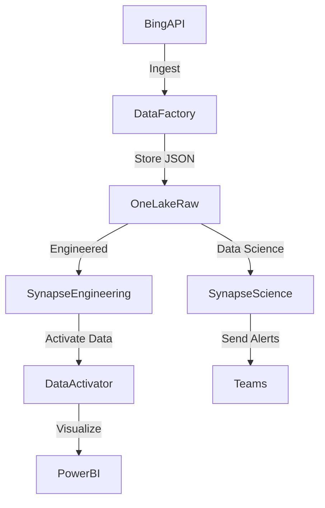

# 🏆 **AdventureWorks: End-to-End Data Engineering Pipeline**

🚀 **Transforming Raw Data into Actionable Insights**  

---

## **📌 Overview**

The **AdventureWorks** project demonstrates a complete **data engineering pipeline** powered by **Azure services** to **ingest, transform, and visualize sales and product data**.  

This pipeline follows the **Medallion Architecture** (Bronze, Silver, and Gold layers) to ensure **data quality**, **scalable processing**, and **efficient reporting**—all while delivering actionable business insights.  

---

## **🌟 Key Features**

✅ **Automated Ingestion**: Seamless data extraction using **Azure Data Factory**.  
✅ **Scalable Storage**: **Azure Data Lake Gen2** manages Bronze, Silver, and Gold layers.  
✅ **Dynamic Data Transformation**: Processed in **Azure Databricks** with **PySpark**.  
✅ **Curated Reporting**: Aggregated views in **Azure Synapse Analytics** for rich insights.  
✅ **Interactive Visualizations**: **Power BI dashboards** provide a user-friendly analytics experience.  

---

## **📐 Architecture**



### **1. Data Ingestion**  
- **Azure Data Factory** orchestrates the ingestion of raw CSV files into the **Bronze layer** in **Azure Data Lake Gen2**.  

### **2. Raw Data Store (Bronze)**  
- Stores raw, unprocessed data as it is ingested.  

### **3. Transformation (Silver)**  
- **Azure Databricks** performs data cleaning, validation, and enrichment.  

### **4. Serving (Gold)**  
- **Azure Synapse Analytics** creates curated views for **business intelligence**.  

### **5. Reporting**  
- **Power BI** connects to **Synapse Analytics** to generate **dynamic dashboards** for decision-making.  

---

## **⚙️ Tech Stack**

| **Category**         | **Tools & Technologies**             |  
|-----------------------|---------------------------------------|  
| **Ingestion**         | Azure Data Factory                  |  
| **Storage**           | Azure Data Lake Gen2                |  
| **Processing**        | Azure Databricks, PySpark           |  
| **Serving**           | Azure Synapse Analytics             |  
| **Visualization**     | Power BI                            |  
| **Data Formats**      | CSV, Parquet                        |  

---

## **📥 Data Ingestion**

- **Azure Data Factory** extracts raw CSV files from HTTP sources and stores them in the **Bronze layer** of **Azure Data Lake Gen2**.  

---

## **🥈 Silver Layer Transformation**

- The **Silver layer** processes raw data to enrich and clean it using **Azure Databricks**.  

Example transformations:  

```python
from pyspark.sql.functions import *
from pyspark.sql.types import *

# Load Data
df_sales = spark.read.format("csv").option("header", "true").load("abfss://bronze@.../AdventureWorks_Sales")

# Transformations
df_sales = df_sales.withColumn('StockDate', to_timestamp('StockDate')) \
                   .withColumn('OrderNumber', regexp_replace(col('OrderNumber'), 'S', 'T')) \
                   .withColumn('TotalValue', col('OrderQuantity') * col('OrderLineItem'))

# Save to Silver Layer
df_sales.write.format("parquet").mode("append").option("path", "abfss://silver@.../AdventureWorks_Sales").save()
```

---

## **🌟 Gold Layer: Aggregated Data**

The **Gold layer** focuses on aggregating and optimizing data for advanced reporting.  

### **1. Sales Analysis View**  
Aggregates sales data for performance monitoring.  

```sql
CREATE VIEW AdventureWorks_Gold.vw_SalesAnalysis AS
SELECT
    s.OrderDate,
    s.OrderNumber,
    p.ProductName,
    c.FullName AS CustomerName,
    t.Region,
    s.OrderQuantity,
    s.OrderLineItem,
    s.OrderQuantity * s.OrderLineItem AS TotalAmount
FROM
    AdventureWorks_Silver.Sales s
JOIN AdventureWorks_Silver.Products p ON s.ProductKey = p.ProductKey
JOIN AdventureWorks_Silver.Customers c ON s.CustomerKey = c.CustomerKey;
```

### **2. Customer Insights View**  
Analyzes customer behavior, such as order frequency and total spending.  

```sql
CREATE VIEW AdventureWorks_Gold.vw_CustomerInsights AS
SELECT
    c.FullName,
    COUNT(s.OrderNumber) AS TotalOrders,
    SUM(s.OrderQuantity * s.OrderLineItem) AS TotalSpent
FROM
    AdventureWorks_Silver.Sales s
JOIN AdventureWorks_Silver.Customers c ON s.CustomerKey = c.CustomerKey
GROUP BY
    c.FullName;
```

### **3. Product Performance View**  
Evaluates sales trends across different products.  

```sql
CREATE VIEW AdventureWorks_Gold.vw_ProductPerformance AS
SELECT
    p.ProductName,
    COUNT(s.OrderNumber) AS TotalOrders,
    SUM(s.OrderQuantity) AS TotalQuantitySold,
    SUM(s.OrderQuantity * s.OrderLineItem) AS TotalRevenue
FROM
    AdventureWorks_Silver.Sales s
JOIN AdventureWorks_Silver.Products p ON s.ProductKey = p.ProductKey
GROUP BY
    p.ProductName;
```

---

## **📊 Reporting**

- **Power BI Dashboards** connect to **Azure Synapse Analytics** to generate intuitive visualizations of:  
  - **Sales Trends**: Track daily and monthly sales performance.  
  - **Customer Insights**: Identify top customers based on orders and spending.  
  - **Product Performance**: Analyze top-selling products and revenue contribution.  
  - **Regional Analysis**: Visualize sales performance by region and country.  

---

## **📈 Insights Delivered**

- **Sales Trends**: Uncover seasonal sales patterns.  
- **Customer Insights**: Identify high-value customers.  
- **Product Performance**: Understand top-performing products.  
- **Regional Analysis**: Measure sales distribution across regions.  

---

## **📌 Conclusion**

The **AdventureWorks Data Engineering Pipeline** exemplifies how **Azure Data Factory**, **Databricks**, and **Synapse Analytics** can collaboratively build a **scalable and efficient pipeline**, while **Power BI** transforms data into **valuable insights**.  

By leveraging the **Medallion Architecture**, this project ensures high data quality and optimized processing—providing a reliable framework for businesses to make data-driven decisions.  
